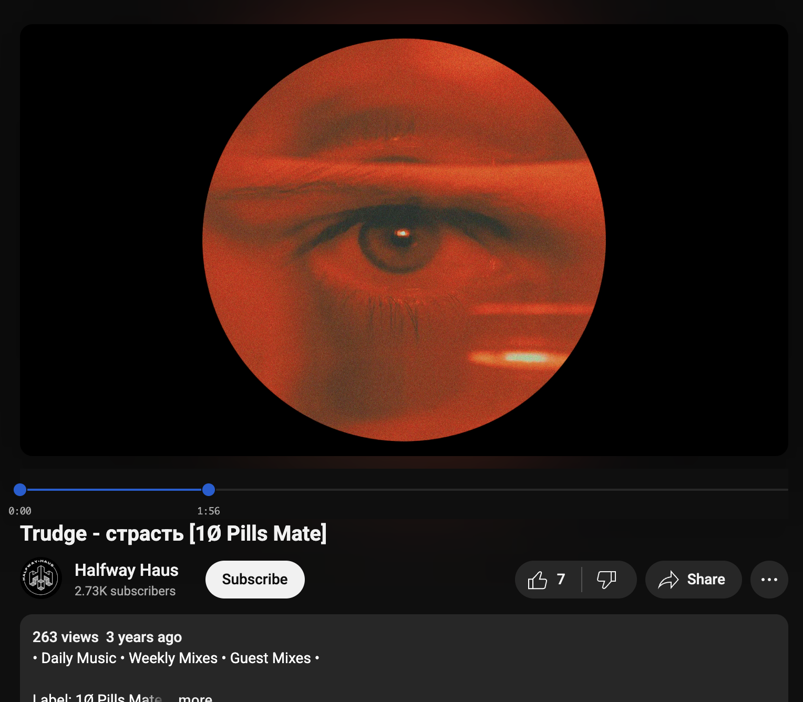

# YouTube Loop Extension

Claude slop that it wrote in 5minutes. I've never even looked at the code, god
knows what is in there. But it works for my use case of wanting to loop over
specific parts of youtube videos, over and over and over and over again.

## Installation

### Chrome/Brave Browser

1. Download or clone this repository
2. Open Chrome/Brave and navigate to `chrome://extensions/`
3. Enable "Developer mode" in the top right corner
4. Click "Load unpacked" and select the folder containing these files
5. The extension will now be active on YouTube

### Firefox

1. Download or clone this repository
2. Open Firefox and navigate to `about:debugging`
3. Click "This Firefox" in the left sidebar
4. Click "Load Temporary Add-on"
5. Select the `manifest.json` file from the downloaded folder
